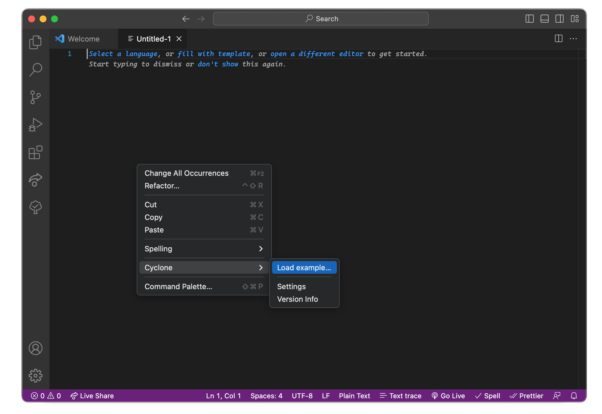
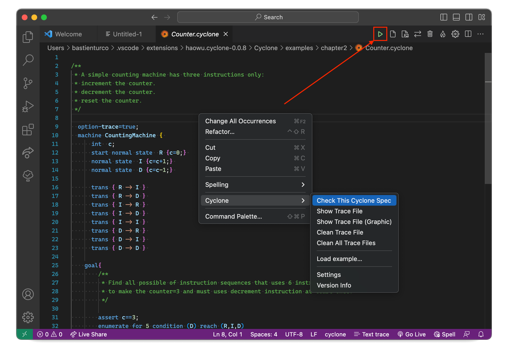
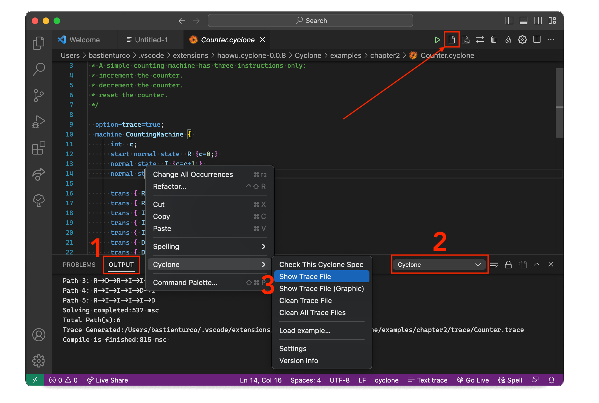
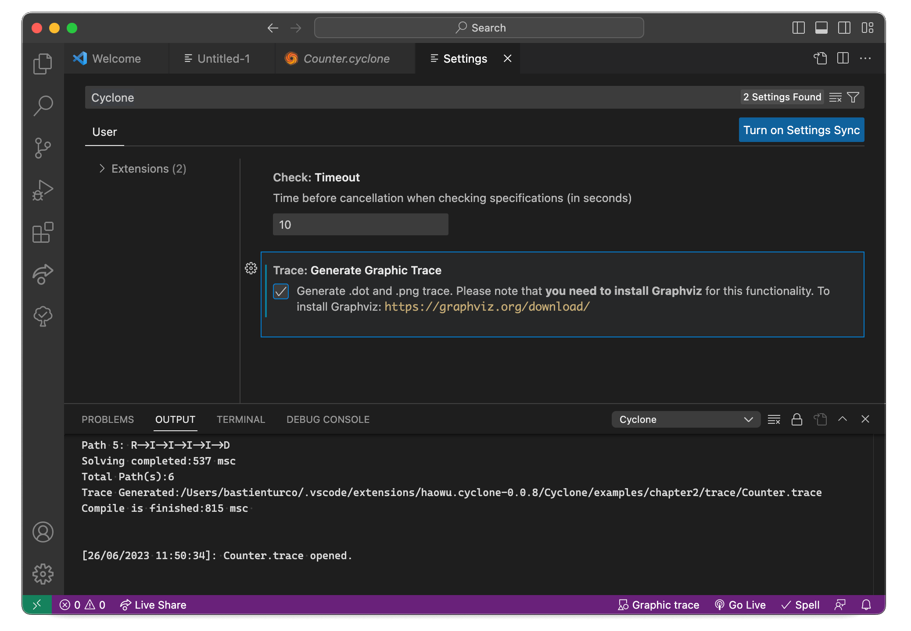
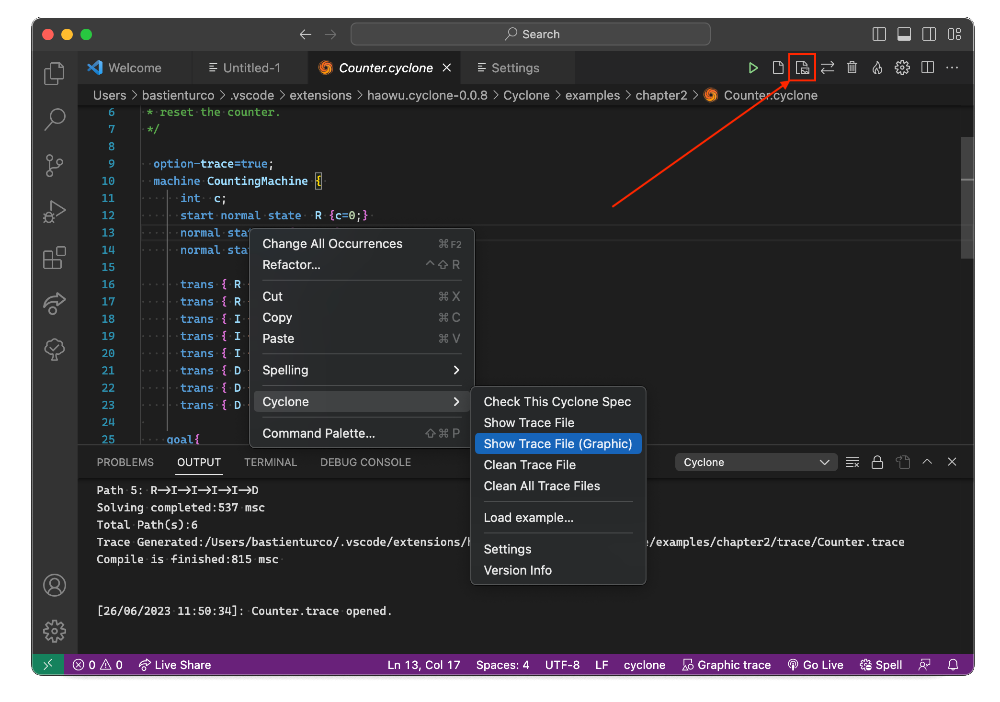
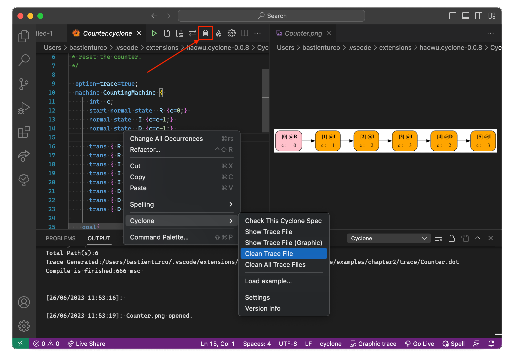

# Cyclone plugin for Visual Studio Code

This plugin adds support for the cyclone specification language for graph-based structures.

Cyclone aims to provide users a formal way of verifying/testing graph-based strcutures. Cyclone works together with our engine [uran](https://github.com/classicwuhao/uran) and compiles a specification into a set of path conditions that can be efficiently solved by an SMT solver. Click [here](https://classicwuhao.github.io/cyclone_tutorial/tutorial-content.html) to learn more about cyclone.

## Features

- Cyclone syntax and semantic highlights.
- Running cyclone checker on cyclone specifications.
- Trace files display (text and image based)
- Time out settings
- Cyclone specifications examples

## Installation
1. Download "Cyclone-0.1.0.vsix" file from this repo.
2. Open VSCode.
3. Open "Extensions" panel (CTRL + SHIFT + X).
4. Click on "..." button.
5. Choose "Install from VSIX..." command.
6. Pick "Cyclone-0.0.8.vsix" file and confirm.
7. Wait until a notification appears.
8. Click on "Reload now" button.
9. Open any .cyclone file.
10. Right click your source code editor and choose menu `Cyclone -> Check This Cyclone Spec.`
11. Open "Output" panel.
12. Open "Cyclone" channel.
13. Output should be there.

## Get started

A simple walkthrough to display basic usage of cyclone. 

### Load example
Open a new file and right click to open menu. Then in **Cyclone** menu, click on **Load example** and select ``chapter2`` then ``Counter.cyclone``.

           
### Check a spec
Now that you have opened the example, add the following line ``'option-trace=true;'`` and click on **Check This Cyclone Spec** in **Cyclone** menu.  
You can also click the launch button.

            
### Show the trace
Once the check is done, open a terminal and go to **Output** (1) -> **Cyclone** (2) to get details on the check. Then in **Cyclone** menu click on **Show Trace File** (3).   
You can also click on the document button.

### Change settings
The trace opened isn't very handy, let's generate an image based trace instead. First in **Cyclone** menu click on **settings** (or on the gear button). In the settings menu check ``Generate Graphic Trace``.  
You could also simply click on the arrows button to change the settings. 
### **Please note that you will need Graphviz installed** 

            
### Show image based trace
Come back to your Counter file and **check** the spec again. Once finished, in **Cyclone** menu click on **Show Trace (Graphic)**.  
You can also click on the second document button.

          
### Clean trace files
To avoid deleting trace files by hand, you can click **Clean Trace** or on $(trash) in **Cyclone** menu.   
You can also click on the bin button or on the flame button but this  last one will delete all traces from all cyclone files in the same directory.
