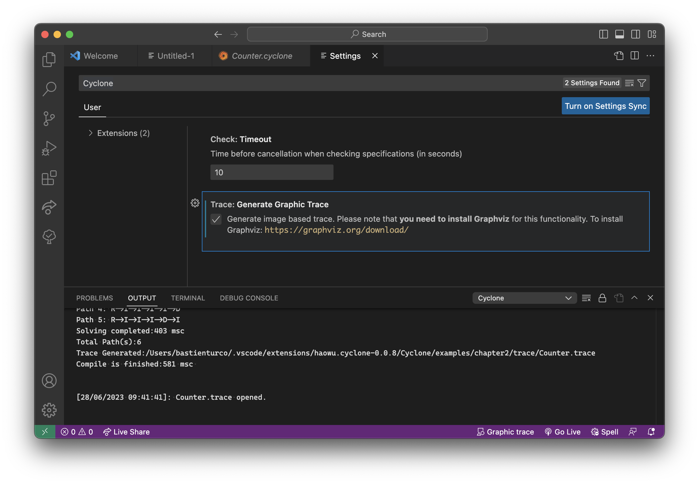

# Cyclone plugin for Visual Studio Code

This plugin adds support for the cyclone specification language for graph-based structures. Cyclone is a new specification language for verifying/testing graph-based structures. Unlike other formal methods tools, Cyclone uses simple notations and allows users to construct verification tasks by building graphs. Cyclone promotes the idea of think in graph, and makes verification tasks easy to be understood/visualised and learn for those who do not have verification background. Click here to learn more about cyclone.

## Features

- Cyclone syntax and semantic highlights.
- Running cyclone checker on cyclone specifications.
- Trace files display (text and image based)
- Time out settings
- Cyclone specifications examples

## Installation
1. If your processor architecture is x86_64, download `Cyclone-x64.vsix` file from this repo. If your processor architecture is ARM (Macbook M1/M2 for example) download `Cyclone-ARM.vsix` file from this repo.
2. Open VSCode.
3. Open "Extensions" panel (CTRL + SHIFT + X).
4. Click on "..." button.
5. Choose "Install from VSIX..." command.
6. Pick `Cyclone-x64.vsix` or `Cyclone-ARM.vsix` file, depending on your architecture (see **1.**) and confirm.
7. Wait until a notification appears.
8. Click on "Reload now" button.
9. Open any .cyclone file.
10. Right click your source code editor and choose menu `Cyclone -> Check This Cyclone Spec.`
11. Open "Output" panel.
12. Open "Cyclone" channel.
13. Output should be there.

## Get started
Cyclone VS Code Extension Features:

### Load example
Open a new file and right click to open menu. Then in **Cyclone** menu, click on **Load example** and select a sample spec. For example, choose ``chapter2`` -> ``Counter.cyclone``.

           
### Check a spec
Open a Cyclone spec, add the following line ``'option-trace=true;'`` and click on **Check This Cyclone Spec** in **Cyclone** menu. You can also click the launch icon.

            
### Show the trace
Once the check is done, open a terminal and go to **Output** (1) -> **Cyclone** (2) to get results about current check. In **Cyclone** menu, click **Show Trace File** (3). 
You can also click on the document icon.

### Change settings
To generate picture based trace file. First in **Cyclone** menu click on **settings** (or on the gear icon). In the settings menu tick ``Generate Graphic Trace``.  
You could also simply click the arrows icon to change the settings. 
### **Please note that you will need to install Graphviz** 

            
### Show image based trace
Once a picture-based trace is finished, click the **Cyclone** menu and choose **Show Trace (Graphic)**.  
You can also click on the second document button.

          
### Clean trace files
You can choose **Clean Trace** in the **Cyclone** menu to delete trace files from last check. You can also click the bin icon. Click the flame icon to delete all traces from previous checks.

